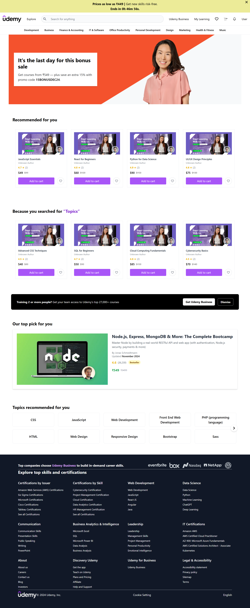

# Udemy Clone

A feature-rich Udemy Clone built using React with Vite. This project replicates core functionalities of the Udemy platform, offering an interactive and responsive user interface for online course browsing, purchase, and management.

---

## Features

- User-friendly interface inspired by Udemy's design
- Course browsing and search functionality
- Responsive layout for desktop and mobile devices
- Dynamic routing for course details
- State management using modern React patterns

---

## Getting Started

### Prerequisites

- **Node.js**: Ensure you have Node.js installed. [Download Node.js](https://nodejs.org/)
- **Vite**: This project is built with Vite, which will be installed as part of dependencies.

### Installation

1. Clone the repository:

   ```bash
   git clone https://github.com/your-username/udemy-clone.git
   cd udemy-clone
   ```

2. Install dependencies:

   ```bash
   npm install
   ```

### Running the Project

1. Start the development server:

   ```bash
   npm run dev
   ```

2. Open your browser and navigate to:

   ```
   http://localhost:5173
   ```

### Building for Production

To create an optimized build for deployment:

```bash
npm run build
```

Serve the `dist` folder using any static file server.

---

## Home Page UI Preview



Add a screenshot of your homepage UI in the `path-to-homepage-image.png` location or update the path with the actual image location.

---
